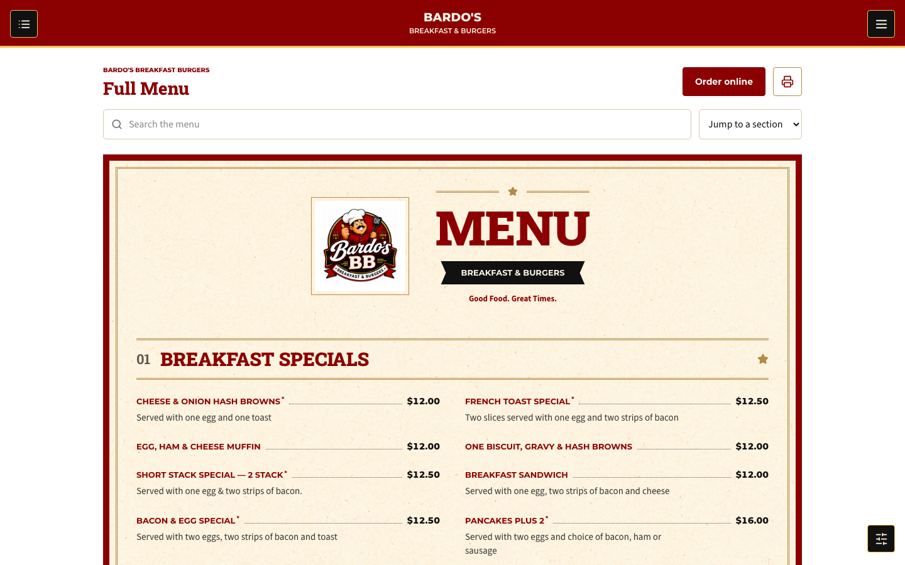

# Bardo's Breakfast & Burgers

<p align="center">
  
</p>

A branded restaurant website and local business operations app for **Bardo's
Breakfast & Burgers in Salem, Oregon**, built with React, TypeScript, Vite and
Firebase on the Wayne Tech Lab **S.F.W.A. / .SYSTEMX Forever WebApp** foundation.

[Repository](https://github.com/WayneTechLab/Bardos-Breakfast-Burgers) ·
[Restaurant Runbook](.SYSTEMX/docs/RESTAURANT-OPERATIONS.md) ·
[Brand References](.SYSTEMX/docs/BARDOS-BRAND-ALIGNMENT.md) ·
[UI/UX Acceptance](.SYSTEMX/docs/UIUX-ACCEPTANCE.md) ·
[Wiki](https://github.com/WayneTechLab/Bardos-Breakfast-Burgers/wiki)

> **Status:** implemented and tested against local Firebase emulators. This is
> not a production launch. Real Firebase configuration, Stripe sandbox
> acceptance, business policies and operational integrations remain release
> requirements. Pushing this repository does not deploy the website.

## Website And Menu



- Complete menu with **141 sellable item/variant rows across 16 categories**,
  based on the verified source package. Search, category jumps, live published
  availability and a full-menu browser print view are included.
- Shared diner styling based on the approved brand guide and menu references:
  deep red, cream paper, gold rules, black ribbons and dotted price leaders.
  The approved logo is unchanged; only the paper texture was generated.
- Self-hosted Roboto Slab, Montserrat and Source Sans 3 fonts, with licenses
  included. Menu names, prices and approved descriptions remain editable text,
  not text baked into artwork. Generated mockup images are not pricing evidence.
- Home, About, Menu, Ordering & Help, Contact, Sign In, Order Online and Account
  pages, with responsive layouts, keyboard navigation and offline/error states.
- Top-left in-page section navigation, top-right site menu and bottom-right
  page controls. Mobile page controls sit in a separate bottom bar.
- The approved logo stays at the top left of the header. The page-section button
  is fixed outside the header, 100px below its bottom edge, with content clearance
  on narrow screens. The settings
  cog offers English / Español, remembers the selection locally and synchronizes
  it across tabs. Public pages, sign-in, menu categories, source menu items and
  print copy are translated; IDs, prices and stored records are unchanged.
  Private ordering/staff screens and custom CMS content remain in English.
  New or edited menu copy falls back to its source text until its exact wording
  has a translation in `src/i18n/spanish.ts`.

The browser print view shares the website's menu data and theme; the verified
sample is five Letter pages. It is not a press-ready CMYK/bleed package.
Spreadsheet and Google Drive synchronization are intentionally **not implemented**.

## Restaurant Workspace

Authenticated staff use `/manage`; private owner features require level 5.

| Area | Implemented scope |
| --- | --- |
| Overview, POS, Orders, Kitchen | Menu basket, server-owned prices, order states, cash handling and local payment simulation |
| Menu | Item editing, prices, publish/unpublish, availability, conflict checks and CSV export |
| Customers, Tickets | Persistent customer records and support requests with status/priority |
| Inventory | Stock ledger, reorder thresholds and history |
| Staff & HR, Schedule, Time Clock | Employee records, schedules, clock-in/out and raw time exports |
| Billing & Expenses | Operational vendor/expense ledger |
| Website CMS | Published text content shown on the homepage |
| Account Access, Audit | Owner-managed roles, account disabling and backend audit entries |

The official Stripe server SDK is integrated for hosted Checkout, refunds,
subscriptions, customer portal and signed webhooks. **No real payment processing
is enabled by placeholder configuration.** Customer checkout remains unavailable
until configured. Local staff simulation does not contact Stripe or count as
paid sales. Stripe Terminal/card readers, receipt hardware, payroll, recipe-based
inventory consumption and accounting integrations are not implemented.

## Account Levels

| Level | Account | Access |
| --- | --- | --- |
| 0 | Guest | Public menu and content; no sign-in required |
| 1 | Member | Free account; own orders and support tickets |
| 2 | Pro | Paid entitlement tier when Stripe is configured |
| 3 | Diamond | Paid entitlement tier when Stripe is configured |
| 4 | Employee | Private restaurant workspace |
| 5 | Owner | Staff access plus private HR, expenses, account access and audit |

Authorization is enforced by authenticated backend functions. Direct Firestore
client writes and all Storage access are denied. Public reads are restricted to
active menu items and published content. App Check and privileged MFA are
required outside the emulator; production acceptance is still pending.

## Local Development

Prerequisites: Node.js 24 for app tooling, Node.js 22 for the deployed Functions
runtime, Java 21 for Firebase emulators, and npm. The emulator uses the host Node
executable. See the runbook for workstation/runtime details.

```bash
npm ci
npm ci --prefix functions
npm run local:firebase
npm run local:seed
npm run wtl:local -- start-day
```

The app normally opens at `http://127.0.0.1:5173`; use `/services` for the menu,
`/login` for sign-in and `/manage` for the workspace. Emulator UI normally uses
`http://127.0.0.1:4000`. Launchers choose available loopback ports. Check live
ports with `npm run wtl:local -- status` and `npm run local:firebase:status`.

The isolated Firebase project is `demo-bardos-local`. The seed creates fictional
business records and five development accounts, including `owner@bardos.local`.
Credentials and role details are in the [local account runbook](.SYSTEMX/docs/RESTAURANT-OPERATIONS.md#local-development).
These are public emulator fixtures, never production accounts. Google sign-in
uses Firebase's mock provider popup locally. Re-seeding preserves menu/business
edits but resets the fixture account roles.

Generated `.env.development.local`, `functions/.secret.local`, emulator exports,
runtime state, logs and browser evidence are ignored by Git. Do not publish them.

```bash
# Stop emulators and wait for their export before restarting.
npm run local:firebase:stop
# Stop this repository's owned app/dashboard processes.
npm run wtl:local -- end-day
```

For frontend-only work, `npm run dev` starts Vite. Full auth, data and business
workflows require the local Firebase services above.

## Verification

```bash
npm run ci:all
npm run test:emulators
npm run test:restaurant-ui
npm run test:uiux
npm run test:brand
npm run test:language
npm audit --prefix functions
npm run wtl:sync -- --check
npm run wtl:deploy -- --preflight
```

Run emulator/browser suites with the app and emulators started and seeded.
Run data-mutating suites sequentially: they temporarily edit shared fixtures.
Install the browser once with `npm run browser:install` when needed.

- CI covers lint, TypeScript, SYSTEMX/domain tests, static security checks,
  dependency auditing and the production build.
- Emulator acceptance covers roles, rules, isolation, server pricing, business
  records, order transitions and signed Stripe webhook fixtures. Fixtures do not
  establish actual Stripe sandbox or live payment acceptance.
- UI/UX acceptance covers 156 responsive route checks, automated accessibility
  scans, record editors, navigation, menu completeness and customer workflows.
- Brand acceptance checks the unchanged logo checksum, loaded fonts, menu
  colors, all 141 variants at four viewport widths, price overlap and print view.

Screenshots, JSON reports and print samples are generated locally under
`.SYSTEMX/LAN/Temp/`. Automated accessibility checks do not replace manual
assistive-technology and real-device testing. Preflight does **not** deploy.

## Project Structure

| Path | Purpose |
| --- | --- |
| `src/pages/` | Public, customer account and restaurant workspace routes |
| `src/components/business/` | POS, orders, billing, MFA, editors and CMS rendering |
| `src/data/` | Verified menu baseline and published-menu subscription |
| `src/auth/` | Auth session and account-level handling |
| `src/brand.css` | Shared brand palette, fonts and screen/print styling |
| `functions/` | Firebase business API, Stripe integration and domain tests |
| `scripts/` | Local Firebase launcher, seed and acceptance suites |
| `public/assets/` | Approved logo, generated paper and licensed local fonts |
| `docs/assets/` | Repository documentation images |
| `wiki/` | GitHub Wiki source pages |
| `.SYSTEMX/` | Operator CLI, setup, project runbooks, status and release tooling |

## Release Boundaries

Before launch, configure the real Firebase project and auth providers, verify
staff MFA/App Check, provision the owner securely and test real Stripe sandbox
lifecycles. Confirm venue/contact details, descriptions, tax/refund/fulfillment
policies, backups, retention and restaurant workflows. Checkout defaults closed
in production; the production Firebase project remains a placeholder.

See [Production Release Requirements and Explicit Limits](.SYSTEMX/docs/RESTAURANT-OPERATIONS.md#production-release-requirements).
No live deployment, payment acceptance or complete restaurant rollout is implied
by a passing build or a GitHub push.

## Documentation And Template Credit

The application runbooks in `.SYSTEMX/docs/` are the current implementation
reference. GitHub Wiki source lives in `wiki/`; wiki changes must be published
separately to `Bardos-Breakfast-Burgers.wiki.git` when those pages are updated.
Keep generated SYSTEMX metadata aligned with `npm run wtl:sync`.

Created from [WayneTechLab/SFWA-WTL-TEMPLATE](https://github.com/WayneTechLab/SFWA-WTL-TEMPLATE),
the S.F.W.A. / .SYSTEMX Forever WebApp foundation by
[Wayne Tech Lab LLC](https://WayneTechLab.com). The template supplies the React,
TypeScript, Vite, Firebase, setup and operator tooling foundation.
