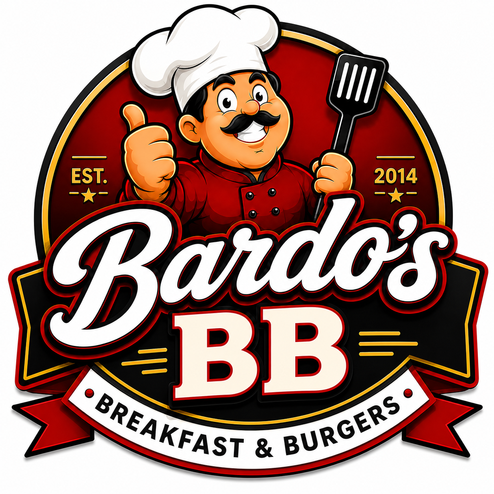

# Bardo's Breakfast Burgers

<p align="center">
  
</p>

**Bardo's Breakfast Burgers** is a Salem, Oregon restaurant webapp concept built
from the Wayne Tech Lab **S.F.W.A. Template / .SYSTEMX Forever WebApp** base.
The first pass turns the standard React, TypeScript, Vite, Firebase-ready shell
into a branded local restaurant experience for breakfast, burgers, pickup,
catering, and rewards.

[Repository](https://github.com/WayneTechLab/Bardos-Breakfast-Burgers) ·
[Wiki](https://github.com/WayneTechLab/Bardos-Breakfast-Burgers/wiki) ·
[WayneTechLab.com](https://WayneTechLab.com)

## Webapp Concept

- Bold first screen using the supplied Bardo's BB logo.
- Restaurant copy for Salem, OR with breakfast, burger, and catering cues.
- Menu page with starter item concepts and room for pricing/modifiers.
- Contact page ready to connect to email, ordering, or catering intake.
- Rewards route that preserves the template's local account-level demo.
- SYSTEMX docs, setup scripts, Firebase configuration, and CI commands retained
  for future production hardening.

## Local Development

```bash
npm install
npm run dev
```

Open the Vite URL printed by the command, usually `http://localhost:5173`.

For the SYSTEMX local operator flow:

```bash
npm run wtl:doctor -- --strict=false
npm run wtl:local -- start-day
npm run wtl:local -- status
```

Stop the owned local session when finished:

```bash
npm run wtl:local -- end-day
```

## Useful Commands

| Need | Command |
| --- | --- |
| Start webapp | `npm run dev` |
| Typecheck | `npm run typecheck` |
| Build | `npm run build` |
| Lint | `npm run lint` |
| SYSTEMX diagnostics | `npm run wtl:doctor -- --strict=false` |
| SYSTEMX local session | `npm run wtl:local -- start-day` |
| Full local CI gate | `npm run ci:all` |

## Project Structure

| Path | Purpose |
| --- | --- |
| `src/pages/` | Customer-facing app routes for Bardo's. |
| `src/components/` | Layout and navigation components. |
| `public/assets/bardos-logo.png` | Runtime logo asset used by the webapp. |
| `docs/assets/bardos-logo.png` | Repository documentation logo asset. |
| `wiki/` | GitHub wiki source pages. |
| `.SYSTEMX/` | Wayne Tech Lab operational layer, setup automation, and docs. |

## Template Credit

This project was created from
[WayneTechLab/SFWA-WTL-TEMPLATE](https://github.com/WayneTechLab/SFWA-WTL-TEMPLATE),
the S.F.W.A. Template / .SYSTEMX Forever WebApp foundation by Wayne Tech Lab
LLC. The template provides the baseline React, TypeScript, Vite, Firebase,
documentation, setup, and operator tooling.

## Notices

This repository is currently a branded webapp concept. Restaurant hours,
address, menu prices, online ordering, payment processing, privacy language,
accessibility review, and production deployment details should be verified
before launch.
